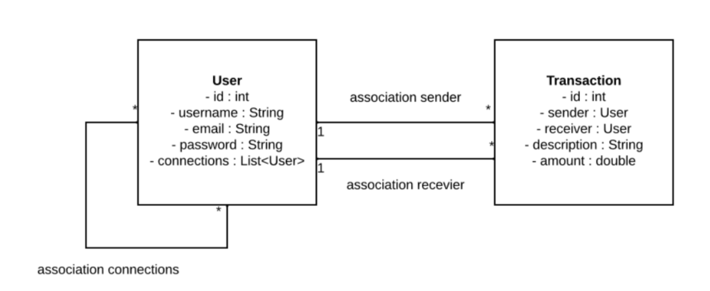
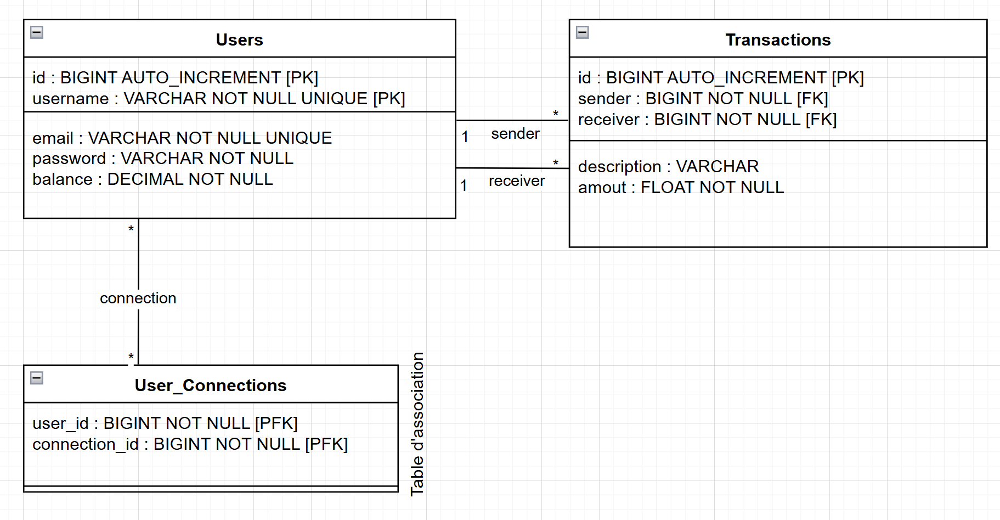

# Pay My Buddy
The Pay My Buddy application is a solution that allows users to send money to their friends or contacts quickly and easily, freeing them from the constraints of traditional bank transfers.

# Getting Started

* Java v21.0.2
* Spring Boot v3.3.5
* Spring v6.1.14
* Maven v3.9.9
* Mysql v8.0.37

## Login to application
You can use these accounts to connect with authorizations :
 * username : user / email : user@user.com / password : user
 * username : friend / email : friend@friend.com / password : friend
 * username : ami / email : ami@ami.com / password : ami
 * username : copain / email : copain@copain.com / password : copain

## UML Diagram

## MPD

### Reference Documentation
For further reference, please consider the following sections:

* [Official Apache Maven documentation](https://maven.apache.org/guides/index.html)
* [Spring Boot Maven Plugin Reference Guide](https://docs.spring.io/spring-boot/3.3.5/maven-plugin)
* [Create an OCI image](https://docs.spring.io/spring-boot/3.3.5/maven-plugin/build-image.html)
* [Spring Data JPA](https://docs.spring.io/spring-boot/3.3.5/reference/data/sql.html#data.sql.jpa-and-spring-data)

### Guides
The following guides illustrate how to use some features concretely:

* [Accessing Data with JPA](https://spring.io/guides/gs/accessing-data-jpa/)
* [Accessing data with MySQL](https://spring.io/guides/gs/accessing-data-mysql/)

### Maven Parent overrides

Due to Maven's design, elements are inherited from the parent POM to the project POM.
While most of the inheritance is fine, it also inherits unwanted elements like `<license>` and `<developers>` from the parent.
To prevent this, the project POM contains empty overrides for these elements.
If you manually switch to a different parent and actually want the inheritance, you need to remove those overrides.

